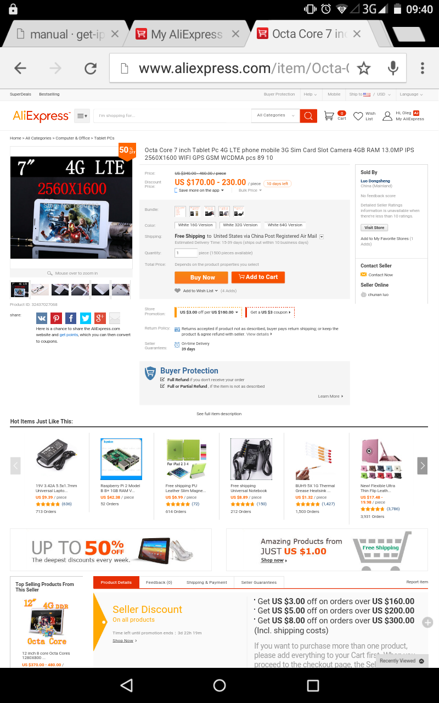
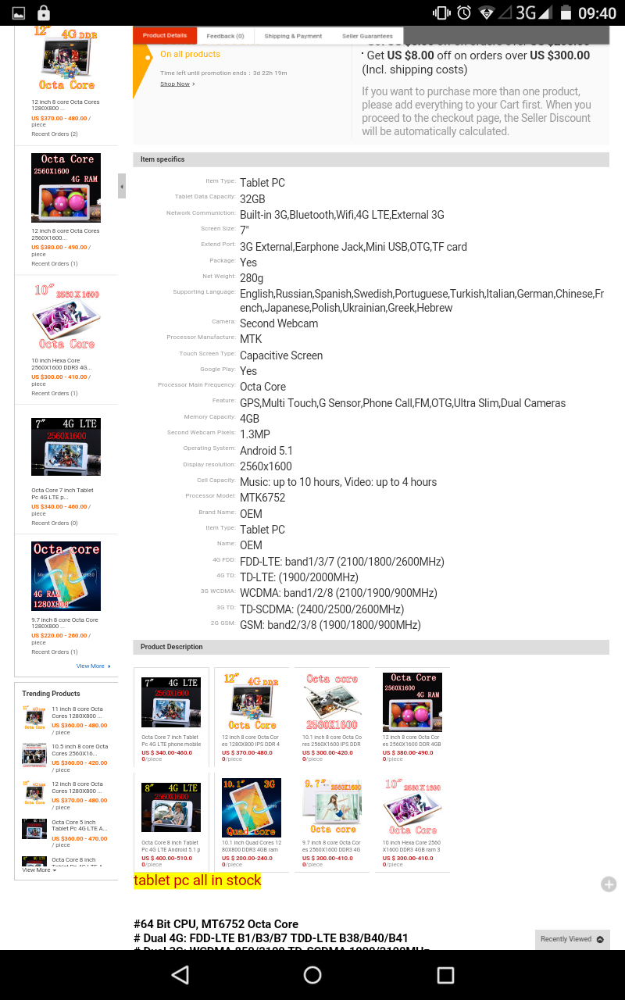
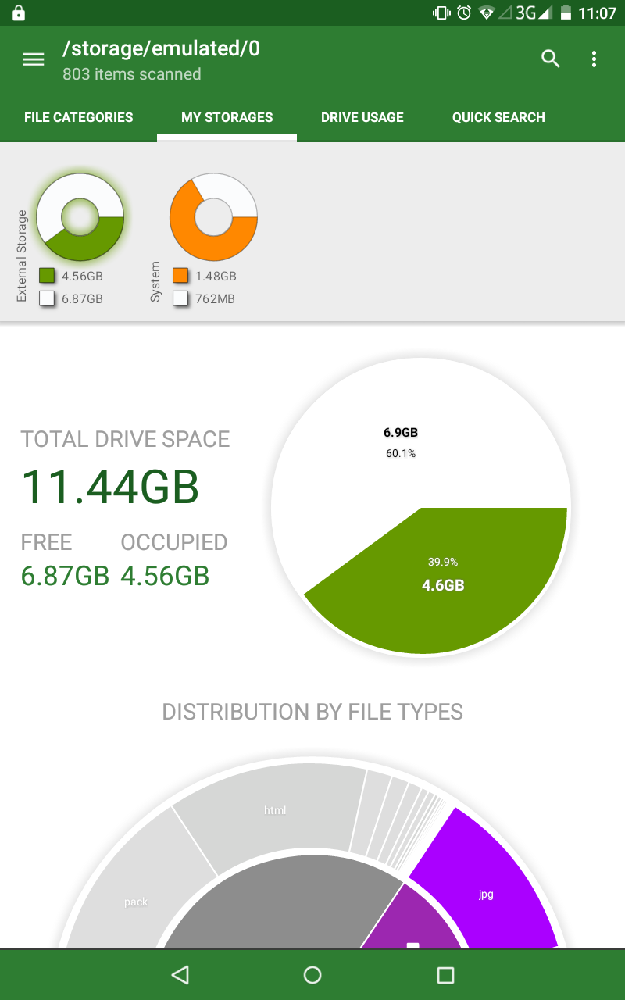
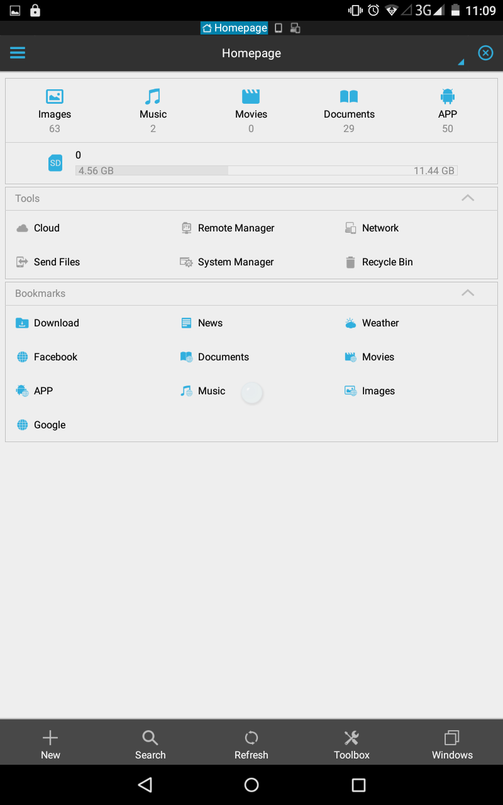
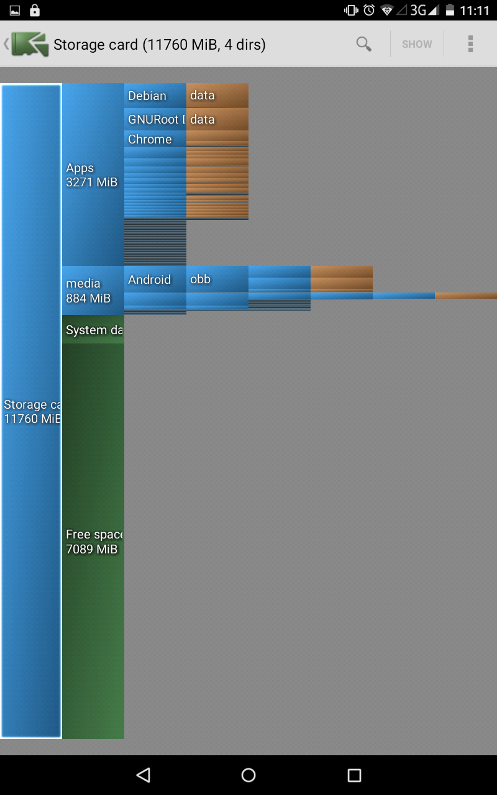
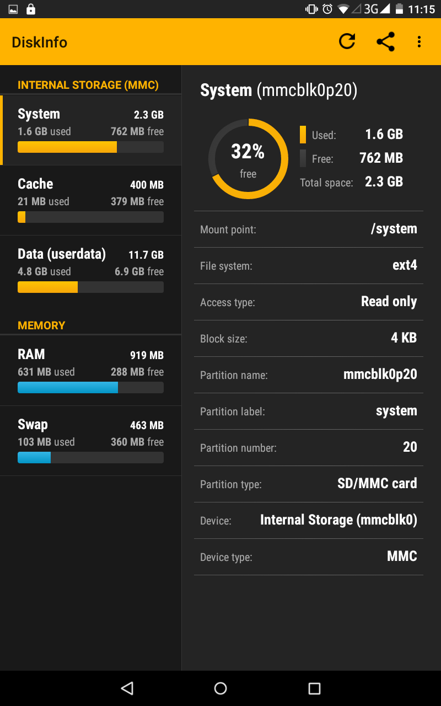
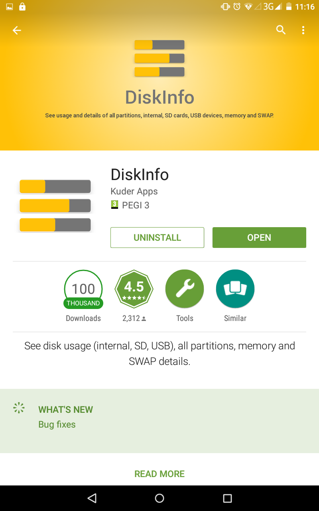

# Screenshots for the device I have bought

The specs don't match the ones sold to me :-(

 * CPU advertised octa-core, actually is **quad-core**
 * Screen advertised 2560x1600, actually is **1280x720**
 * RAM memory advertised 4Gb, actually is **1Gb**
 * Storage advertises 64Gb, actually is **16Gb**

After the fraud pointed to the seller,
they keep the original fake claims on their page (see screenshots below)

As a proof of the actual hardware specs here are the screenshots
made with popular hardware benchmark apps.

## Product page

# Storage

